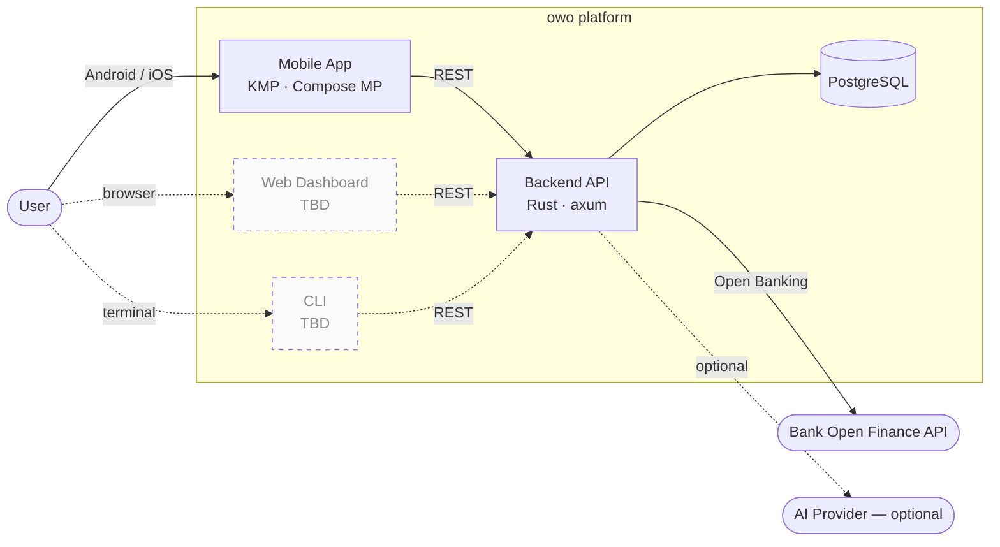
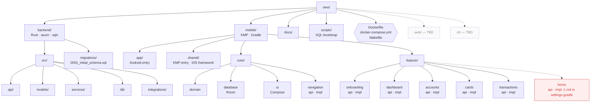
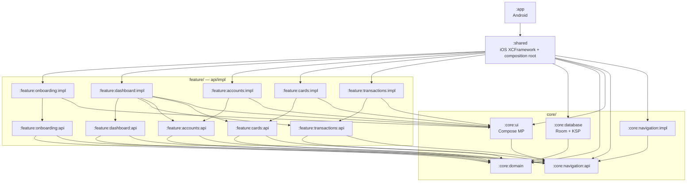
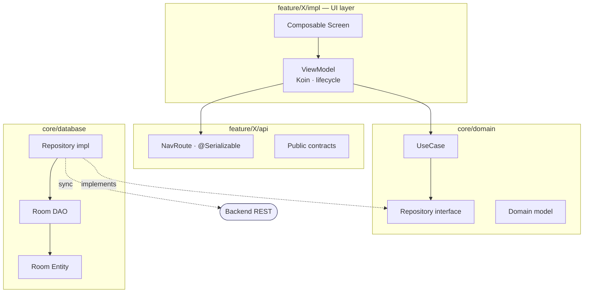
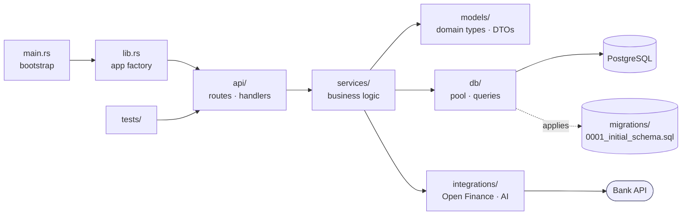
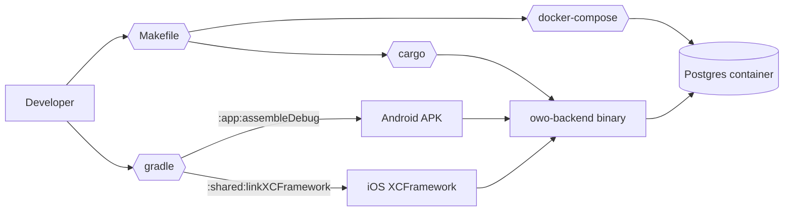

# owo — System Design

Snapshot of the current repository structure as of 2026-05-08. All diagrams are
[Mermaid](https://mermaid.js.org/) — edit them directly in this file; GitHub,
Obsidian, IntelliJ, and VS Code (with the Mermaid extension) render them inline.

> **Legend** — Solid arrow = compile/runtime dependency. Dashed arrow = future /
> planned. Stadium nodes (`([ ])`) = external systems. Hex (`{{ }}`) = build /
> tooling artifacts.

---

## 1. System context (C4 L1)

---

## 2. Repository monorepo layout

> ⚠ `mobile/feature/home/{api,impl}` exists on disk but is **not registered** in
> `mobile/settings.gradle.kts`. Either include it or delete it.

---

## 3. Mobile module dependency graph (KMP)

api/impl split: `:feature:X:api` exposes navigation routes + public contracts;
`:feature:X:impl` carries Compose UI + ViewModels + Koin wiring. Features depend
on **other features' api modules only** — never on impl. `:shared` is the
composition root that wires every impl together for the iOS XCFramework and
Android entry.

---

## 4. Mobile clean-architecture layering (per feature)

---

## 5. Backend internal structure (Rust)

Cargo crate `owo-backend` (edition 2024). Stack: **axum** HTTP, **sqlx**
Postgres + migrations, **tokio**, **tracing**, **tower-http**, **rust_decimal**
for money, **argon2** for passwords.

---

## 6. Build & run pipeline

---

## 7. Status matrix

| Component       | Path                  | State                 | Notes                                    |
|-----------------|-----------------------|-----------------------|------------------------------------------|
| Backend         | `backend/`            | Scaffolded            | mod.rs stubs, deps chosen, 1 migration   |
| Mobile shared   | `mobile/shared/`      | Wiring complete       | All feature impls aggregated             |
| Mobile features | `mobile/feature/*`    | UI scaffolded         | onboarding, dashboard, accounts, cards, transactions |
| `feature/home`  | `mobile/feature/home/`| **Orphan**            | Not in `settings.gradle.kts`             |
| Web             | `web/`                | Not started           | Mentioned in CLAUDE.md only              |
| CLI             | `cli/`                | Not started           | Mentioned in CLAUDE.md only              |
| Docs            | `docs/`               | Minimal               | `database.md`, `logo.svg`, this file     |

---

## 8. How to edit

- Open this file in any Mermaid-aware viewer (GitHub renders inline).
- Live editor: <https://mermaid.live> — paste a single fenced block to iterate.
- For richer canvas-style editing: import the Mermaid into draw.io or Excalidraw
  (both have Mermaid import).
- Keep the **Status matrix** in sync when modules land or get removed.
